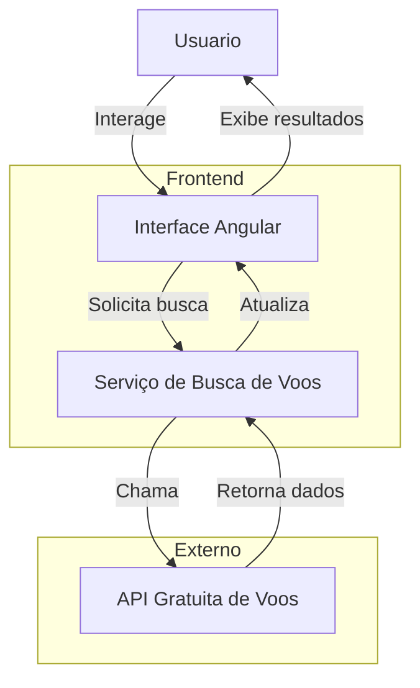

```mermaid
flowchart TD
    A[Usuario] -->|Interage| B[Interface Angular]
    B -->|Solicita busca| C[Serviço de Busca de Voos]
    C -->|Chama| D[API Gratuita de Voos]
    D -->|Retorna dados| C
    C -->|Atualiza| B
    B -->|Exibe resultados| A

    subgraph Frontend
        B
        C
    end
    subgraph Externo
        D
    end
```
